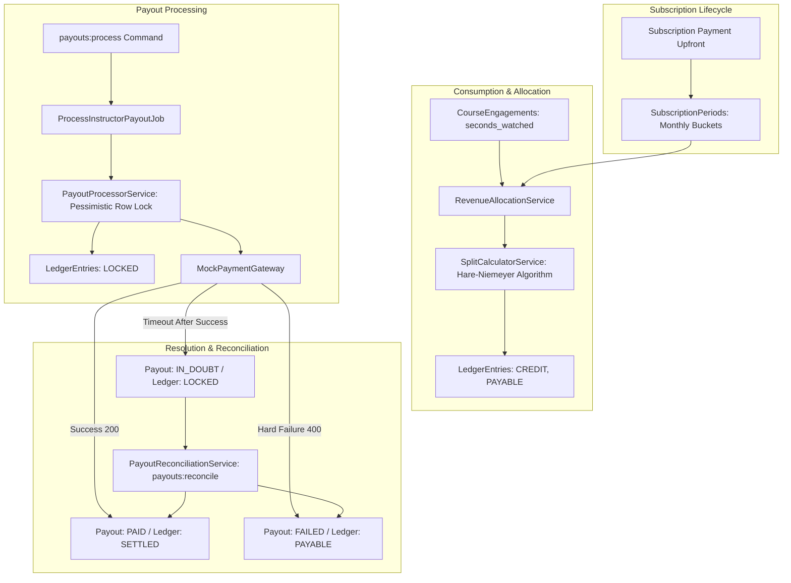
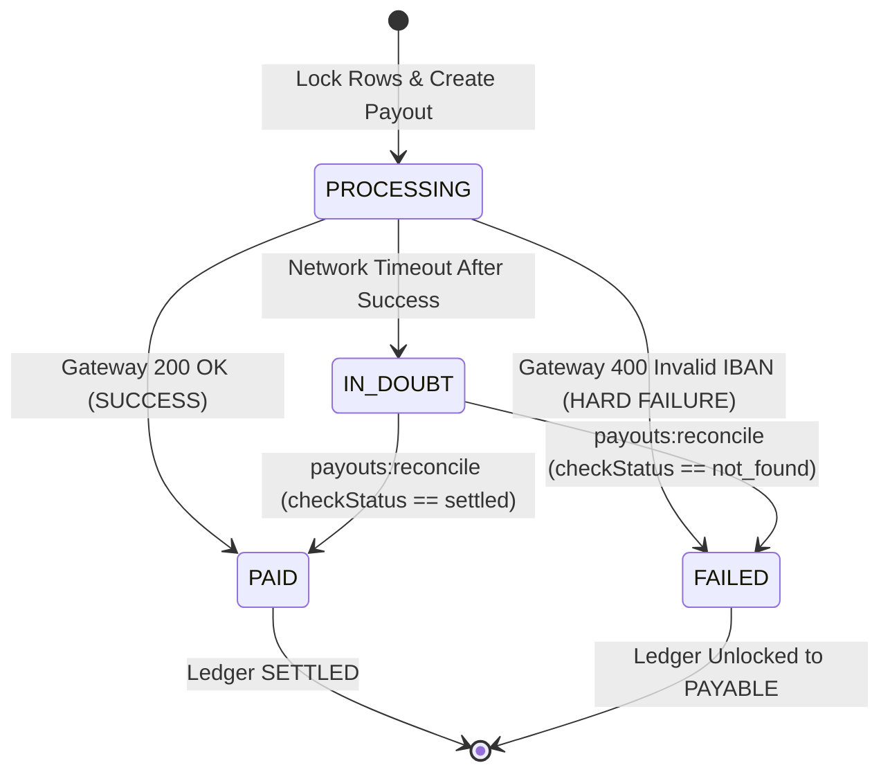

# Architectural Design Document: Instructor Revenue Ledger

## 1. Executive Summary & Core Philosophy

The **Instructor Revenue Ledger** is the financial core of an LMS platform responsible for moving real money. In financial software engineering, network and server failures are guaranteed: cron jobs overlap, background workers crash, database connections hiccup, and third-party banking gateways time out.

The primary architectural principle of this system is **correctness under failure**:
* **Immutability over Mutation**: We never execute `UPDATE users SET balance = balance + X`. Balances are the mathematical sum of immutable ledger entries.
* **Deterministic Conservation of Money**: Not a single penny is created or lost during non-even splits ($\sum \text{allocated} \equiv \text{pool}$).
* **Zero Double-Payouts**: Distributed concurrency locks and unique database idempotency tokens prevent duplicate transfers across multi-server environments.
* **Resilience to Byzantine Gateway Failures**: We never guess what happened during a gateway timeout; funds remain locked in escrow until verified via reconciliation.

---

## 2. Key Architectural Decisions



### A. The Append-Only Double-Entry Ledger (`ledger_entries`)
* **Decision**: Money movements are stored as discrete, immutable credit/debit records.
* **Why**: Prevents race conditions and preserves a 100% auditable history. If an earning was mistaken or refunded, we issue an offsetting debit entry (`type: refund_clawback`), never deleting or modifying historical records.
* **State Machine**:
  $$\text{PAYABLE} \xrightarrow{\text{Locked into Payout Batch}} \text{LOCKED} \xrightarrow{\text{Bank Confirms 200 OK}} \text{SETTLED}$$
  * If a bank transfer fails permanently, the status safely reverts from `LOCKED` $\rightarrow$ `PAYABLE` and `payout_id` is set back to `null`.

### B. Integer Cents Precision (`BIGINT`)
* **Decision**: All financial amounts are stored as integer cents (e.g., $100.00 = `10000`).
* **Why**: Floating-point types (`FLOAT`, `DOUBLE`) in programming languages and relational databases suffer from IEEE 754 precision issues (e.g., `0.1 + 0.2 = 0.30000000000000004`). Integers guarantee exact precision without rounding drifts.

### C. Upfront Accrual Accounting (`subscription_periods`)
* **Decision**: Subscriptions paid upfront for multi-month terms (Quarterly = 3 months, Annual = 12 months) are partitioned into monthly accounting periods.
* **Why**: Recognizing $120 of annual subscription revenue on Day 1 exposes the platform to severe financial risk if the student cancels in Month 2. By unlocking revenue month-by-month, future unearned periods remain `PENDING`. If a refund occurs, unearned periods are cancelled cleanly with **zero clawback friction**.

### D. Separation of Database Commit and Remote Gateway Calls
* **Decision**: Database transactions are never kept open while waiting for remote HTTP banking APIs.
* **Why**: An HTTP timeout to a payment gateway can take 15 to 60 seconds. Keeping a database transaction open for 60 seconds exhausts the database connection pool, holds locks on ledger rows, and causes cascading timeouts across the entire platform. Instead, we lock rows and set `status = LOCKED` inside a 5ms transaction, commit, execute the HTTP call, and then record the outcome in a second short transaction.

### E. Core Database Tables & Schema Overview

| Table | Key Columns & Types | Constraints & Indexes | Financial Purpose |
| :--- | :--- | :--- | :--- |
| **`ledger_entries`** | `instructor_id` (FK)<br>`type` (enum: earning, refund_clawback, payout)<br>`direction` (enum: credit, debit)<br>`amount_in_cents` (BIGINT)<br>`status` (enum: payable, locked, settled, cancelled)<br>`source_type`, `source_id` (morphs)<br>`payout_id` (nullable FK)<br>`idempotency_key` (string, nullable) | • `UNIQUE(idempotency_key)`<br>• **Covering Index:** `(instructor_id, status, amount_in_cents)` | **The Core Financial Ledger**: Append-only log of all financial movements. Derived balance source. |
| **`payouts`** | `instructor_id` (FK)<br>`amount_in_cents` (BIGINT)<br>`status` (enum: pending, processing, paid, in_doubt, failed)<br>`idempotency_key` (string)<br>`external_reference` (string, nullable)<br>`failure_reason` (text, nullable)<br>`paid_at`, `reconciled_at` (timestamps) | • `UNIQUE(idempotency_key)`<br>• Index on `(status)` | **Payout Batches**: Manages gateway transfers, idempotency tokens, and timeout/failure lifecycles. |
| **`subscription_periods`** | `subscription_id` (FK)<br>`period_number` (int)<br>`gross_amount_in_cents` (BIGINT)<br>`platform_amount_in_cents` (BIGINT)<br>`instructor_pool_in_cents` (BIGINT)<br>`status` (enum: pending, open, allocated, cancelled)<br>`start_at`, `end_at`, `allocated_at` | • `UNIQUE(subscription_id, period_number)` | **Monthly Accrual Buckets**: Isolates upfront subscription revenue into distinct monthly accounting periods. |
| **`course_engagements`** | `subscription_period_id` (FK)<br>`student_id` (FK, nullable)<br>`instructor_id` (FK)<br>`course_id` (FK)<br>`seconds_watched` (BIGINT) | • Index on `(subscription_period_id)`<br>• Index on `(instructor_id)` | **Consumption Metric**: Tracks watch duration used to calculate proportional revenue split shares. |

---

## 3. Revenue Allocation Strategy

### The Algorithm: Largest Remainder Method (Hare-Niemeyer)
When splitting a subscription pool among instructors whose courses were consumed, clean integer divisions rarely occur (e.g. $10.00 split equally among 3 instructors = 333.333... cents each). Standard `round()` can create or destroy pennies, violating double-entry balance sheets.

The system uses the **Hare-Niemeyer (Largest Remainder) Algorithm**:

$$\text{Exact Share}_i = \frac{\text{Seconds Watched}_i}{\sum \text{Seconds Watched}} \times \text{Net Pool in Cents}$$

$$\text{Floor Share}_i = \lfloor \text{Exact Share}_i \rfloor$$

$$\text{Remainder Cents} = \text{Net Pool in Cents} - \sum \text{Floor Share}_i$$

The remaining cents are distributed by sorting instructors in descending order of their fractional remainders ($\text{Exact Share}_i - \text{Floor Share}_i$), giving 1 additional cent to each until $\text{Remainder Cents} = 0$.

```
Worked Example ($10.00 pool / 1000 cents split 3 ways):
Instructor A: 100s -> 333.33 cents -> Floor: 333 cents, Remainder: 0.333
Instructor B: 100s -> 333.33 cents -> Floor: 333 cents, Remainder: 0.333
Instructor C: 100s -> 333.33 cents -> Floor: 333 cents, Remainder: 0.333

Sum of Floors = 999 cents. Remainder to distribute = 1 cent.
Sorted Remainders (Tie-break by instructor_id ASC):
1. Instructor A gets +1 cent -> 334 cents ($3.34)
2. Instructor B gets +0 cents -> 333 cents ($3.33)
3. Instructor C gets +0 cents -> 333 cents ($3.33)
Total Allocated = 334 + 333 + 333 = 1000 cents ($10.00 exact).
```

* **Tie-Breaking Rule**: When fractional remainders are identical, ties are deterministically resolved by sorting by `instructor_id` ascending.
* **Conservation Guarantee**: $\sum \text{allocated\_cents} \equiv \text{instructor\_pool\_in\_cents}$ to the exact penny.

### Breakage / Zero-Consumption Policy
If a student maintains an active subscription but watches 0 seconds of video during a billing cycle:
* The unconsumed pool is retained by the platform as breakage / deferred platform revenue.
* Zero artificial instructor ledger earnings are created, maintaining financial integrity.

---

## 4. Idempotency & Concurrency Strategy

To guarantee that overlapping cron schedules, manual admin triggers, or concurrent queue workers never double-pay an instructor, we employ a **Two-Tier Concurrency Lock**:

### Tier 1: Deterministic Composite Idempotency Keys
Every payout batch generates a deterministic key:
$$\text{idempotency\_key} = \text{"payout\_\{instructor\_id\}\_\{cycle\_period\}"}$$

* This key is enforced by a **database `UNIQUE` constraint** on the `payouts` table.
* If two worker processes attempt to initiate Payout for Instructor #42 for cycle `2026-03` simultaneously, Worker B encounters a unique constraint violation and aborts immediately without calling the gateway.

### Tier 2: Pessimistic Row Locking (`SELECT ... FOR UPDATE`)
```php
DB::transaction(function () use ($instructorId, $idempotencyKey) {
    // 1. Lock existing payout record if present
    $existing = Payout::where('idempotency_key', $idempotencyKey)->lockForUpdate()->first();
    if ($existing && in_array($existing->status, [PayoutStatus::PROCESSING, PayoutStatus::IN_DOUBT, PayoutStatus::PAID])) {
        return null; // Already in progress, frozen in doubt, or completed
    }

    // 2. Lock payable ledger rows
    $entries = LedgerEntry::where('instructor_id', $instructorId)
        ->where('status', LedgerStatus::PAYABLE)
        ->lockForUpdate()
        ->get();

    if ($entries->isEmpty()) {
        return null;
    }

    // 3. Create Payout record and transition ledger rows to LOCKED
    $payout = Payout::updateOrCreate(
        ['idempotency_key' => $idempotencyKey],
        ['status' => PayoutStatus::PROCESSING, 'amount_in_cents' => $entries->sum('amount_in_cents')]
    );

    LedgerEntry::whereIn('id', $entries->pluck('id'))->update([
        'status'    => LedgerStatus::LOCKED,
        'payout_id' => $payout->id,
    ]);
});
```

---

## 5. Unreliable Payment Gateway & Timeout Handling

Payment gateways communicate over unreliable networks. Three fundamental outcomes can occur:



1. **Success (200 OK)**:
   * Payout marked `PAID`.
   * Associated `ledger_entries` transitioned to `SETTLED`.
2. **Hard Failure (400 Bad Request / Invalid Account)**:
   * Payout marked `FAILED`.
   * Associated `ledger_entries` unlocked back to `PAYABLE` (`payout_id = null`) so they can be processed once the instructor updates their bank credentials.
3. **Timeout After Success (The Byzantine Zombie State)**:
   * The bank successfully debited the funds, but the HTTP connection dropped before the acknowledgment reached our server.
   * **Action**: We catch `PaymentGatewayTimeoutException`. The payout transitions to **`IN_DOUBT`**.
   * **Escrow Lock**: The ledger entries remain **`LOCKED`**. Money is frozen in escrow: it cannot be refunded, and it cannot be paid out a second time.
   * **Self-Healing Reconciliation Engine (`payouts:reconcile`)**:
     * A scheduled reconciliation job queries the payment gateway: `checkStatus($idempotencyKey)`.
     * If the gateway confirms `'settled'` $\rightarrow$ Payout marked `PAID`, Ledger marked `SETTLED`.
     * If the gateway confirms `'not_found'` $\rightarrow$ Payout marked `FAILED`, Ledger unlocked to `PAYABLE`.

---

## 6. Scaling Considerations (500k Subscriptions, Tens of Millions of Records)

| Scaling Challenge | Architectural Solution |
| :--- | :--- |
| **OOM on Balance Aggregations** | Composite B-Tree Covering Index on `(instructor_id, status, amount_in_cents)`. Aggregate queries like `SELECT SUM(amount_in_cents) WHERE instructor_id = ? AND status = 'payable'` resolve entirely inside the index leaf pages in **< 1ms** without scanning table rows. |
| **Worker Queue Starvation** | `php artisan payouts:process` uses chunked cursor iteration (`chunk(250)`) to dispatch lightweight `ProcessInstructorPayoutJob` messages. Worker memory footprint is capped at ~20MB regardless of instructor count. |
| **Database Lock Contention** | Short-lived transactions: locks are acquired, rows transitioned to `LOCKED`, and the transaction commits **before** the remote HTTP gateway call is made. Database lock hold time is kept under 5ms. |
| **High Table Volume Growth** | Ledger tables append millions of rows monthly. Designed for MySQL native range partitioning by `YEAR(created_at), MONTH(created_at)` to enable instant dropping of historical archives without `DELETE` locks. |

---

## 7. Known Limitations & Future Enhancements

1. **Single Currency Model**:
   * All amounts are currently represented in integer cents (USD equivalent). Supporting multi-currency payouts would require a `currency` column on `ledger_entries` and live FX exchange rate snapshots at the moment of payout execution.
2. **Gateway Polling vs. Webhook Dual-Channel**:
   * Reconciliation currently runs on a scheduled poller (`payouts:reconcile`). In production, this would be supplemented by asynchronous incoming webhooks from the payment provider to settle in-doubt payouts immediately upon gateway notification.
3. **Dynamic Platform Commissions**:
   * Platform commission is currently configured statically (e.g. 30%). In future iterations, this can be made dynamic per instructor tier, course category, or promotional plan type.
4. **Aggregated Engagement Ingestion**:
   * The system assumes student engagement (`seconds_watched`) is ingested via aggregated batch pipelines rather than processing raw sub-second video player heartbeats directly in the relational transactional database.
